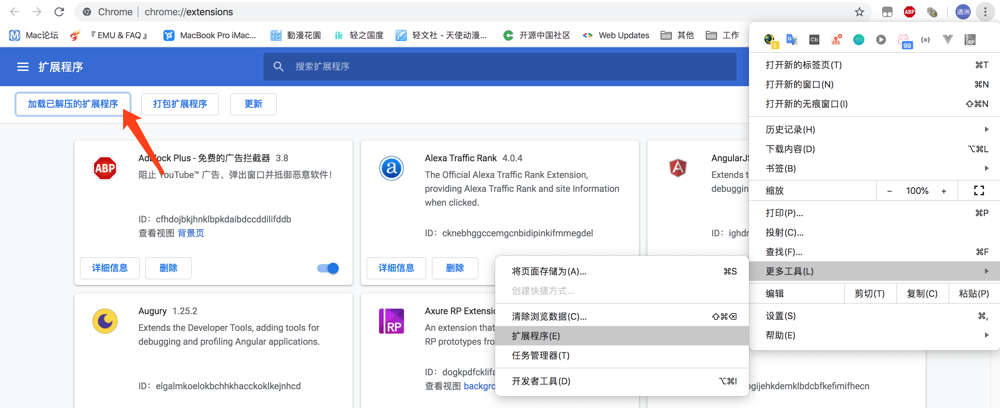
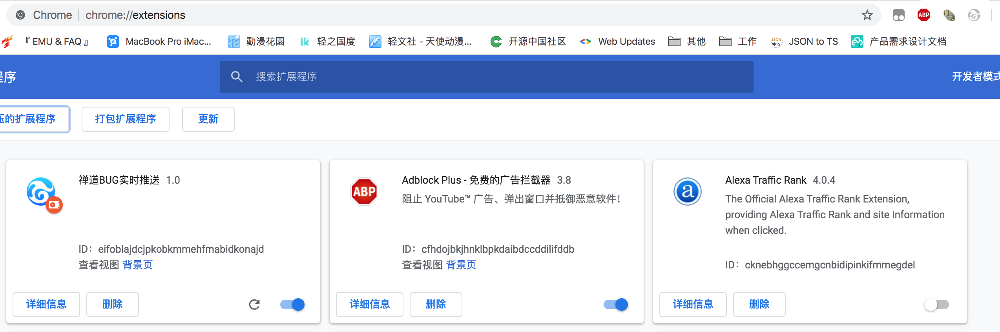
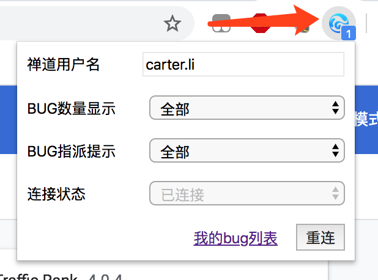
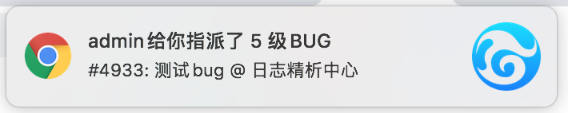

# 禅道BUG实时推送 Chrome 插件

让你及时收到BUG推送

## 使用说明

1. clone 此项目到本地  
```shell
$ git clone https://git.eoitek.net/carter.li/zentao_ext.git
```
2. 打开 Chrome 的扩展程序配置界面，导入你刚才克隆代码的目录  
  
加载之后应该在扩展程序列表中出现了禅道BUG实时推送卡片，在Chrome的扩展程序托盘栏应该出现了禅道的图标（灰色的）  

3. 点击禅道图标，在下拉框中输入你的禅道登录名，然后点击**重连**按钮  

4. 如果禅道图标变亮说明已经和推送服务建立了WebSocket链接。小数字表示当前你名下的BUG数量。只要Chrome浏览器打开着（不需要禅道页面打开），当有新BUG指派给你的时候会有消息提示，点击提示会自动跳转到BUG的禅道页面  


## Q/A

## 为什么不用禅道原本的消息推送

禅道自带的所谓消息推送用的是轮询的方式，导致推送不及时；另外一个问题就是用户必须开着禅道页面才会收到推送（接口轮询是在禅道页面内部进行的），时灵时不灵；还有一个问题是点击推送消息只会把消息关闭而不会打开对应的BUG页面，导致很难用

### 连接不上怎么办

当浏览器打开的时候，推送插件会自动尝试连接服务器；并且每分钟都会检测连接是否正常，如果断开会自动尝试重连。灰色图标表示连接断开；蓝色表示连接正常。如果频繁出现断线问题，请联系作者

### 为什么不发布到 Chrome 的扩展商店

给 Chrome 提交扩展要先交 5 刀成为开发者。这个插件各处都写死了公司的禅道域名，还得配合后台的推送服务（也是我们自己写的），所以完全无法通用。就用开发模式将就一下吧

### 浏览器支持

理论上支持所有 Chrome 内核浏览器，包括 Opera、新版 Edge 和一众兲朝壳浏览器，没测试过

### 我想打赏作者

真的假的？微信红包了解一下
